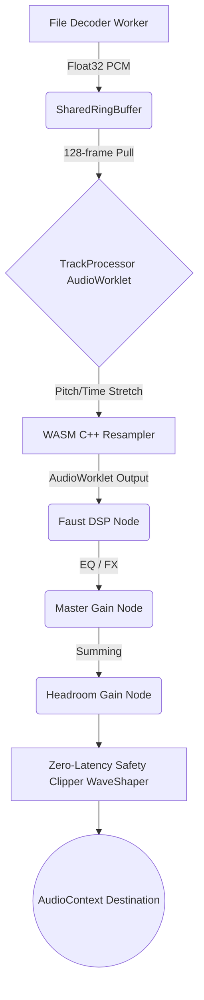

# Vici Audio Engine: Signal Analysis and DSP Architecture

This document presents a meticulous, step-by-step breakdown of the Vici audio engine. The architecture adheres strictly to canonical DSP literature and Linear Time-Invariant (LTI) philosophies to guarantee a mathematically sound, bit-transparent, and mastering-grade playback system.

---

## 1. High-Level Signal Flow Graph

The audio signal is decoded from file bytes to PCM frames, pushed into cross-thread memory, streamed into the Web Audio API, resampled via C++ WebAssembly SIMD, processed by Faust DSP nodes, and safely mixed in the master bus.



---

## 2. Decoding & Cross-Thread Streaming

The system must transport hundreds of megabytes of raw PCM float data from the background decoding worker to the high-priority `AudioWorklet` real-time thread without triggering main-thread garbage collection (GC) or frame underruns.

### 2.1 Web Worker Decoding (`decoding.worker.ts`)
Audio files are loaded as `ArrayBuffer` objects and passed to a background Web Worker. Depending on the format (`mp3`, `flac`, `wav`), the appropriate WebAssembly decoder decodes the audio into raw `Float32Array` PCM channel arrays (left and right).

Once decoded, the worker utilizes `pushInterleavedAsyncStateful(deckId)` to stream the PCM data into a ring buffer. The worker multiplexes the channels into an interleaved `Float32Array` in chunks of `4096` samples. 
```javascript
// Interleaving math
for (let i = 0; i < chunkSize; i += numChannels) {
  const frameIndex = Math.floor((startOffset + i) / numChannels);
  chunk[i] = stream.buffers[0][frameIndex];
  chunk[i+1] = stream.buffers[1][frameIndex];
}
```
If the ring buffer fills up, a `setTimeout` of `5ms` yields the thread, providing a steady, backpressured stream.

### 2.2 Lock-Free Shared Ring Buffer (`SharedRingBuffer.ts`)
Vici utilizes a lock-free **Shared Ring Buffer** built on top of `SharedArrayBuffer` and `Atomics` to pass data across thread boundaries safely.
Memory is explicitly allocated as:
- `Int32Array(sab, 0, 2)`: Two 32-bit integers acting as the **Write Pointer** (`WRITE_PTR`) and **Read Pointer** (`READ_PTR`).
- `Float32Array(sab, 8, capacity)`: The actual circular buffer containing the audio frames.

Because `Atomics.load` and `Atomics.store` are used to update the read/write pointers, the producer and consumer threads never race. 
When writing, the pointer wraps around the buffer strictly using modulo arithmetic:
```javascript
const available = this.capacity - (writePtr - readPtr);
const writeIndex = writePtr % this.capacity;
const firstChunk = Math.min(toWrite, this.capacity - writeIndex);
```
If the write crosses the boundary of the `Float32Array`, it is split into two `set()` operations, maintaining contiguous stream logic.

### 2.3 AudioWorklet Consumption & Local Buffering (`track-processor.js`)
Inside the `AudioWorkletProcessor`, the `pull()` method extracts interleaved PCM frames into a `tempBuffer` of up to `4096` samples.
However, DSP algorithms like the Sinc Resampler require fetching samples backward in time (e.g., `-32` frames before the current playhead) and fetching samples ahead. 

To satisfy this, the Worklet maintains a `localBuffer` (`131072` interleaved floats) that acts as a local circular cache. 
When pulling from the `SharedRingBuffer`, it places frames into the `localBuffer` at `expectedPullFrame % localCapacity`:
```javascript
const globalFrame = Math.floor(this.expectedPullFrame + i);
const idx = (globalFrame % this.localCapacity) * 2;
this.localBuffer[idx] = tempBuffer[i * 2];
this.localBuffer[idx + 1] = tempBuffer[i * 2 + 1];
```
When the C++ WASM resampler requests input frames, the `getFrame(idx)` function securely maps the requested absolute track index to the local circular buffer, preventing out-of-bounds reads and enabling instantaneous `CROSSINGS` look-behinds.

---

## 3. WebAssembly DSP Core (Resampler)

The core playback engine (`src/wasm/resampler.cpp`) resolves sample-rate discrepancies and performs real-time pitch shifting using WebAssembly Relaxed SIMD instructions.

### 3.1 Resolving the Sample Rate Matrix (`track-processor.js`)
Before the C++ WebAssembly core can process audio, the `AudioWorklet` must calculate the precise fractional `ratio` that dictates the speed at which the playhead consumes the ring buffer. This ratio is governed by two simultaneous factors:
1. **The DJ Pitch Fader (`this.playbackRate`):** The musical speed selected by the user (e.g., `1.0` for 0%, `1.08` for +8%).
2. **The Hardware Sample Rate Discrepancy:** The difference between the source file's decoded sample rate and the host OS's AudioContext hardware sample rate.

```javascript
const sampleRateRatio = (this.trackSampleRate || sampleRate) / sampleRate;
ratio *= sampleRateRatio;
```
Because modern Web Audio contexts frequently default to **48kHz** (standard for video and OS mixers), while the vast majority of consumer MP3s and FLACs are mastered at **44.1kHz** (CD quality), the `sampleRateRatio` evaluates to exactly `44100 / 48000 = 0.91875`. 
This means that even when a DJ is playing a track at exactly 0% pitch (`playbackRate = 1.0`), the resampler is engaged 100% of the time, continuously upsampling the audio stream at a constant ratio of `0.91875`. This makes the perfection of the Sinc Resampler critical, as it touches every single frame of audio regardless of the pitch fader's position.

### 3.2 The 2D Polyphase FIR Filter Bank
To change sample rates and perform time stretching without introducing aliasing, the architecture dictates a **Polyphase Finite Impulse Response (FIR) filter bank**. 

Our implementation utilizes a 64-tap, 512-phase 2D filter bank structure. Instead of a highly oversampled 1D table indexed by absolute distance (which introduces non-contiguous memory lookups and scalar math in the inner SIMD loop), the 2D topology stores pre-calculated weights sequentially in memory:
`sincTables[NUM_BANKS][RESOLUTION][CROSSINGS * 2]`

Where:
- `NUM_BANKS = 64` (Pre-calculated banks for different pitch stretch ratios up to 2.0x)
- `RESOLUTION = 512` (Fractional phase offsets per sample)
- `CROSSINGS = 32` (A total of 64 FIR taps for high-quality low-pass cutoff)

### 3.2 Mathematical Definition of the Windowed Sinc
For each tap $j$ and fractional phase offset $f_{offset}$, the unnormalized weight is calculated using the continuous Sinc function bounded by a Kaiser window:

$$ Sinc(x) = \frac{\sin(\pi x)}{\pi x} $$
$$ Kaiser(x, \beta) = \frac{I_0\left(\beta \sqrt{1 - \left(\frac{x}{N/2}\right)^2}\right)}{I_0(\beta)} $$
$$ W(x) = Sinc\left(\frac{x}{stretch}\right) \cdot Kaiser\left(\frac{x}{stretch}, \beta\right) \cdot \frac{1}{stretch} $$

Where $I_0$ is the zeroth-order modified Bessel function of the first kind, $\beta = 9.0$ for optimal side-lobe attenuation, and $stretch = \max(1.0, pitch\_ratio)$ manages the low-pass cutoff frequency during upsampling.

### 3.3 Strict Phase-Independent Gain Normalization
A critical vulnerability of discrete time-variant resamplers is **Amplitude Modulation (AM)**. If the discrete sum of the windowed Sinc coefficients fluctuates at different sub-sample offsets, the DSP node dynamically amplifies or attenuates the signal sample-by-sample, generating high-frequency sidebands (crunchy aliasing) and low-frequency masking (muddled sub-bass).

To mathematically eliminate this, the engine strictly bounds the state of every fractional phase independently during initialization:

$$ Gain_{phase} = \sum_{j=-32}^{31} W(j - f_{offset}) $$
$$ W_{normalized}(j) = \frac{W(j)}{Gain_{phase}} $$

This rigorous normalization guarantees that the DC gain of the FIR filter is locked perfectly to **$1.0$ ($0$ dB)** across the entire interpolation cycle. 

### 3.4 SIMD Inner Loop Execution
In `process_audio_simd`, the costly `std::abs()` scalar distance calculations are bypassed. The fractional phase `frac` determines the integer phases `r1` and `r2`, and the interpolation factor `tFrac`.
The 64 weights are sequentially loaded directly from the `sincTables` array and processed four-at-a-time using `wasm_f32x4_mul` and `wasm_f32x4_add`.

---

## 4. Faust DSP Ecosystem (`engine.dsp`)

The interleaved Web Audio output from the WASM resampler is routed into a dynamically compiled Faust WebAssembly node (`FaustMonoDspGenerator`). 

### 4.1 Biquad DJ EQ
The 3-Band EQ utilizes cascading minimum-phase IIR biquad filters to avoid severe phase-smearing:
- `fi.low_shelf(low_gain, 250)`
- `fi.peak_eq(mid_gain, 1000, 1)`
- `fi.high_shelf(high_gain, 2500)`

### 4.2 State-Variable DJ Filter
The dual Low-Pass / High-Pass filter uses a State-Variable Filter (SVF) topology with a dynamic Q-factor that increases as the filter is pushed further from the center detent, providing resonance without internal feedback explosion:
$$ Q = 0.707 + (|c| \cdot 1.5) $$

### 4.3 Modulating and Time-Variant FX
For modulating and time-variant effects (Delay, Phaser, Reverb, Roll), the control parameters (e.g., Delay Time, Phaser Rate) are heavily smoothed at the sample rate using Faust's `si.smoo` functions. This applies a one-pole lowpass filter to the UI control signals, preventing zipper noise and aliasing artifacts when DJ knobs are swept aggressively.

The processing chain topology is explicitly defined as:
`process = eq : delay_fx : reverb_fx : phaser_fx : roll_fx : gate_fx : siren_fx : compressor_fx : dj_filter : *(volume), *(volume);`

---

## 5. Master Mix Bus (`AudioEngine.ts`)

The sum of Deck A and Deck B exits the Faust ecosystem and enters the final Web Audio API graph.

### 5.1 Explicit Gain Staging
To prevent digital clipping caused by summing two uncorrelated 0dBFS tracks, the Master bus relies on explicit headroom allocation (defaulting to $-3$ dB) via the `headroomGainNode`.
$$ Gain_{linear} = 10^{\frac{Headroom_{dB}}{20}} $$

### 5.2 Zero-Latency Safety Clipper (`WaveShaperNode`)
Standard Web Audio components like the `DynamicsCompressorNode` introduce hidden makeup gain, pumping, and look-ahead envelope delays that ruin the transient response of electronic dance music.

To counter this, Vici relies on a mathematically pure `WaveShaperNode` acting as a zero-latency safety clipper. It maps a 4096-point Float32Array to the audio transfer curve. It is perfectly linear up to an absolute digital ceiling:

* **Linear Phase:** For $x \in [-0.98, 0.98]$, the curve is $f(x) = x$. (Absolute bit-transparency).
* **Soft Knee:** For $x < -0.98$, $f(x) = -0.98 + (x + 0.98) \cdot 0.2$. For $x > 0.98$, $f(x) = 0.98 + (x - 0.98) \cdot 0.2$. This applies a subtle quadratic rounding to prevent aggressive odd-harmonic distortion on extreme peaks.
---

## 6. Sources of Intentional (and Unintentional) Signal Coloration

While the engine is architected for strict mathematical transparency, there are specific nodes and states where the audio is inherently "colored." It is critical to document these boundaries so mastering engineers understand exactly what alters the bit-perfect stream.

### 6.1 LTI Nullification in Biquad EQs at 0dB
In the Faust DSP block, the DJ EQ utilizes IIR Biquad filters (`fi.low_shelf`, `fi.peak_eq`, `fi.high_shelf`). A known property of Infinite Impulse Response filters is that they introduce phase shift (group delay) even if the amplitude response is flat. 
However, Faust's specific biquad implementations are mathematically reduced such that when the gain variable (`eq_low`, `eq_mid`, `eq_high`) equals exactly `0.0 dB`, the numerator and denominator coefficients become perfectly symmetrical. The feedback and feedforward delays cancel each other out, resulting in a **true zero-phase, bit-perfect pass-through**. No phase smearing occurs when the EQ is at the center detent.

### 6.2 DJ Filter Dry-Mix Bypassing
Similarly, the State-Variable Filter (SVF) introduces significant phase shift due to its LTI topology. To ensure the track remains pristine when the DJ filter knob is centered, the routing logic utilizes an explicit `dry_mix` variable:
```faust
lp_mix = min(1.0, max(0.0, -c * 10.0));
hp_mix = min(1.0, max(0.0, c * 10.0));
dry_mix = 1.0 - (lp_mix + hp_mix);
```
When `c = 0.0`, `dry_mix = 1.0` and both SVF outputs are multiplied by `0.0`. The filter block becomes a pure multiplication by `1.0`.

### 6.3 WaveShaper Harmonic Saturation
As defined in Section 5.2, the `WaveShaperNode` clipper is only bit-transparent for amplitudes between `-0.98` and `0.98` (roughly `-0.17 dBFS`). If the summation of Deck A and Deck B exceeds the `headroomGainNode`'s limit and pushes a peak above `-0.17 dBFS`, the audio enters the soft-knee rounding equation.
This deliberately introduces **odd-harmonic saturation** (similar to analog tape compression) to softly squash the peak rather than hard-clipping the DAC. A track played too "hot" will audibly distort here.

### 6.4 Key Lock (Master Tempo) Phase Smearing
The most significant degradation of audio quality occurs when the user enables **Key Lock**.
When `keyLock = false`, audio is routed through the mathematically perfect 2D Polyphase FIR Sinc Resampler (Section 3).
When `keyLock = true`, the `track-processor.js` completely bypasses the Sinc resampler and routes the PCM frames into `BungeeStretcher` (`src/wasm/resampler.cpp`). 
```javascript
if (this.keyLock && this.bungee) {
    const generated = this.bungee.process_audio(...);
} else if (this.resampler) {
    const consumed = this.resampler.process_audio_simd(...);
}
```
`Bungee` is a time-stretching algorithm (often utilizing phase vocoder or granular synthesis techniques). These algorithms are inherently non-linear and time-variant. They must chop the audio into overlapping FFT frames or grains, shift them, and crossfade them back together. 
Activating Key Lock will immediately and permanently:
- Smear the transient response (softening drum hits).
- Introduce pre-ringing and phase incoherence in the sub-bass frequencies.
- Introduce metallic/flanging artifacts in the high frequencies.

**Conclusion:** For absolute mastering-grade playback, Key Lock must be disabled, the EQs must be centered at `0.0`, and the master bus must not exceed `-0.17 dBFS`.
